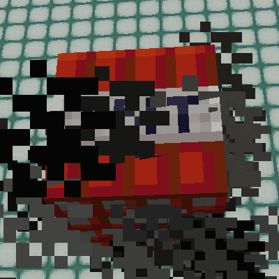
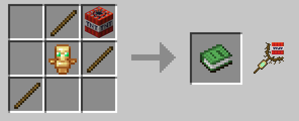
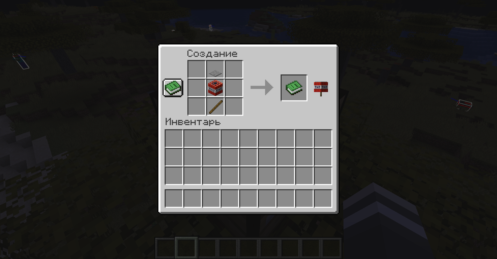
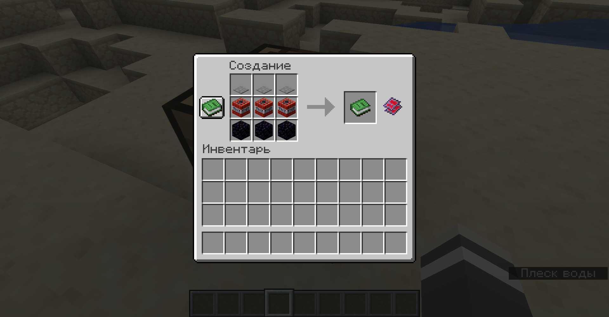
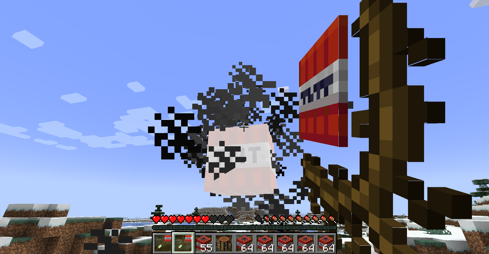
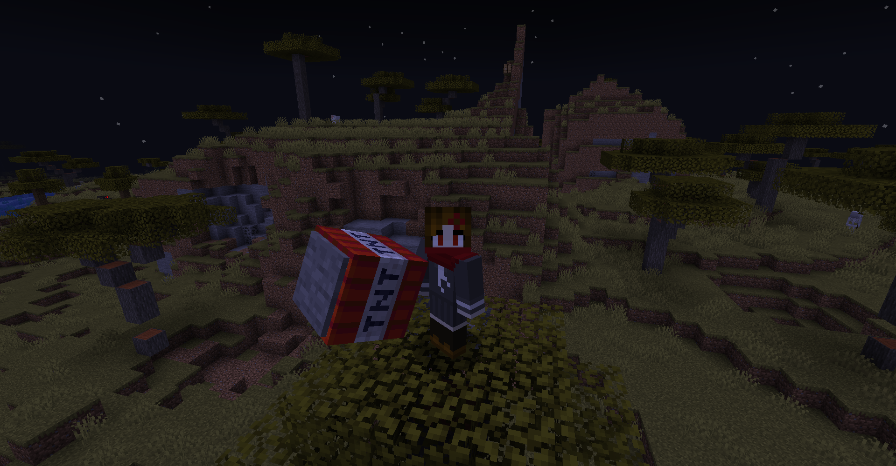
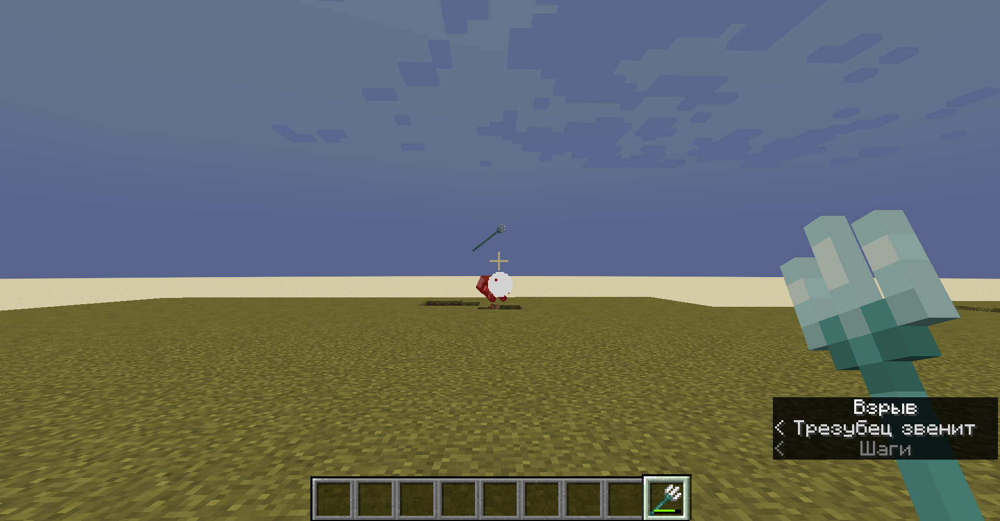

# Explosive Utilities

*Spice of Death*

A data pack and resource pack for Minecraft 1.20+ that adds various explosive tools to your world.

*Note: I will add more stuff over time.*

## Items

### ***Tnt Wand***



The tnt wand is a magic weapon that allows you to manipulate tnt.

Right-clicking can consume a piece of tnt from your inventory to summon a lit tnt 4 blocks in front of you, even if that's inside a block. This has a cooldown of 40 ticks by default.

Holding right-click whilst looking at a lit tnt will allow you to corral it. It will follow your cursor and it's fuse will be frozen so it doesn't blow up in your face. This uses actual motion so you can build up momentum and lob around tnt with it. You can also do this with tnt minecarts and creepers, but just because you can, does not mean you should. Also with ghast fireballs, but you'll need to keep your cursor moving to keep control, lest you set yourself ablaze.

Press left-click to create an explosion 1 block in front of you at the cost of 1 tnt. It is slightly less powerful than a normal explosion but has extreme knockback on non-player entities. Has a cooldown of 80 ticks by default. Damage from the explosion will be reduced by 80% for you.

Combining all three moves, you can create, aim, and launch a piece of tnt like a hand-held tnt cannon.

It can be crafted using three sticks, a totem of undying, and a piece of tnt (see above.)

#### **Give command:**

```text
/function xplsvtlts:tnt_wand/on_craft
```

### ***Tnt on a Stick***



Slapping together a stick, tnt, and a pressure plate creates a highly volatile weapon (see above.) Use is not recommended for those who enjoy living.

#### **Give command:**

```
/function xplsvtlts:tnt_on_a_stick/on_craft
```

### ***Reactive Plating***



An upgrade for your equipment that adds an explosive touch in exchange for added durability use. 

You will be protected from damage by the reactive explosions, but it will eat through any armor you are wearing.

Crafted using 3 obsidian, 3 tnt, and 3 pressure plates of any kind (see above,) and can be applied to a piece of equipment by tossing it on an anvil with the reactive plating (note: will use up anvil over time.)

The following items can be upgraded:

- Swords, pickaxes, shovels, hoes, and axes

All of these tool items will detonate when attacking entities, stripping blocks, tilling soil, making dirt paths, etc..

I intend to also make them detonate when mining blocks, but I've yet to find a reliable method of general block break detection.

- Shears

Similar to the previous tool items, but will not detonate when attacking entities.

- Armor

Makes your armor detonate in reaction to taking non-explosive damage from entities. 

Has a default cooldown of 120 ticks divided by the number of armor pieces you are wearing with the upgrade, for a minimum cooldown of 30 ticks. Wearing all 4 pieces will greatly increase the power of the explosion.

Additionally, upgrading an armor piece with reactive plating will give it blast protection II if blast protection is not already present on the armor piece, no repair costs involved.

- Trident

Detonates when attacking, similar to the tool items, but will also detonate on the first thing it comes into contact with when thrown.

- Shield

Detonates when blocking non-explosive damage. 

Additionally, if you are crouching, it can consume 1 gunpowder from your inventory to create a larger explosion.

#### **Give command:**
```text
/function xplsvtlts:reactive_plating/on_craft
```

#### **Make reactive command (makes the held item reactive):**

```text
/function xplsvtlts:reactive_plating/make_held_item_reactive
```

## Compatiblity

Tnt Wands can be used to corral mobs made explosive by [PigsThatGoBoomInTheNight.](https://www.planetminecraft.com/data-pack/pigsthatgoboominthenight "PigsThatGoBoomInTheNight on Planet Minecraft")

Tnt Wands can be used to corral bees if [Incendiary Bees](https://www.planetminecraft.com/data-pack/incendiary-bees "Incendiary Bees on Planet Minecraft") is installed.

## Configuration

You can set the summon cooldown for the tnt wand with this command, defaults to 40:

```text
/scoreboard players set tnt_wand_summon_cooldown xplsvtlts <ticks>
```

You can set the explosive punch cooldown for the tnt wand with this command, defaults to 80:

```text
/scoreboard players set tnt_wand_punch_cooldown xplsvtlts <ticks>
```

You can set the base cooldown for the reactive armor with this command, defaults to 120:

```text
/scoreboard players set reactive_armor_maximum_cooldown xplsvtlts <ticks>
```

You can set whether to disable the corraling restrictions on the tnt wand with the following command. 1 to disable, 0 to enable, defaults to 0.

```text
/scoreboard players set disable_tnt_wand_corraling_restrictions xplsvtlts <1 or 0>
```

## Installation

Grab a version from [RELEASES.](https://github.com/ona-li-toki-e-jan-Epiphany-tawa-mi/Explosive-Utilities/releases "Explosive Utilities Releases Page")

Place the resource pack inside your Minecraft installation's resource pack folder and enable it. [See for more information.](https://minecraft.fandom.com/wiki/Tutorials/Loading_a_resource_pack "A Minecraft Wiki tutorial on installing resource packs")

Place the datapack inside your world's datapacks folder. [See for more information.](https://minecraft.fandom.com/wiki/Tutorials/Installing_a_data_pack "A Minecraft Wiki tutorial on installing data packs")

The pack will automatically finish installation on world load, but you can force it using (recommended if updating pack, note: resets configurations):

```text
/function xplsvtlts:install/initialize
```

## Uninstallation

To uninstall, you first need to run this command:

```text
/function xplsvtlts:install/uninstall
```

After that, remove the datapack from your world's datapacks folder before reloading.

## Links

- [Explosive Utilities Planet Minecraft Page](https://www.planetminecraft.com/data-pack/explosive-utilities "Explosive Utilities on Planet Minecraft")
- [PigsThatGoBoomInTheNight Planet Minecraft Page](https://www.planetminecraft.com/data-pack/pigsthatgoboominthenight "PigsThatGoBoomInTheNight on Planet Minecraft")
- [PigsThatGoBoomInTheNight GitHub Repository](https://github.com/ona-li-toki-e-jan-Epiphany-tawa-mi/PigsThatGoBoomInTheNight "PigsThatGoBoomInTheNight on GitHub")
- [Incendiary Bees Planet Minecraft Page](https://www.planetminecraft.com/data-pack/incendiary-bees "Incendiary Bees on Planet Minecraft")
- [Incendiary Bees GitHub Repository](https://github.com/ona-li-toki-e-jan-Epiphany-tawa-mi/Incendiary-Bees "Incendiary Bees on GitHub")

## Screenshots





## Changelog

- Added combatiblity with Incendiary Bees to corral them with the tnt wand.
- Added visual and auditory cue for when the tnt wand's cooldowns are over.
- Added reactive plating and it's effects to various equiment items.
- Added tnt on a stick.
- ???.
- Optimizations, baby!
- Added config option to disable the entity restrictions on the tnt wand corraling ability.
- Moved minimum version to 1.20.

Make sure to run the following command if updating (note: resets configurations):

```text
/function xplsvtlts:install/initialize
```

Note: the CustomModelData number used for tnt wands has changed, making any preexisting ones malfunction. Either craft or give yourself a new one.
